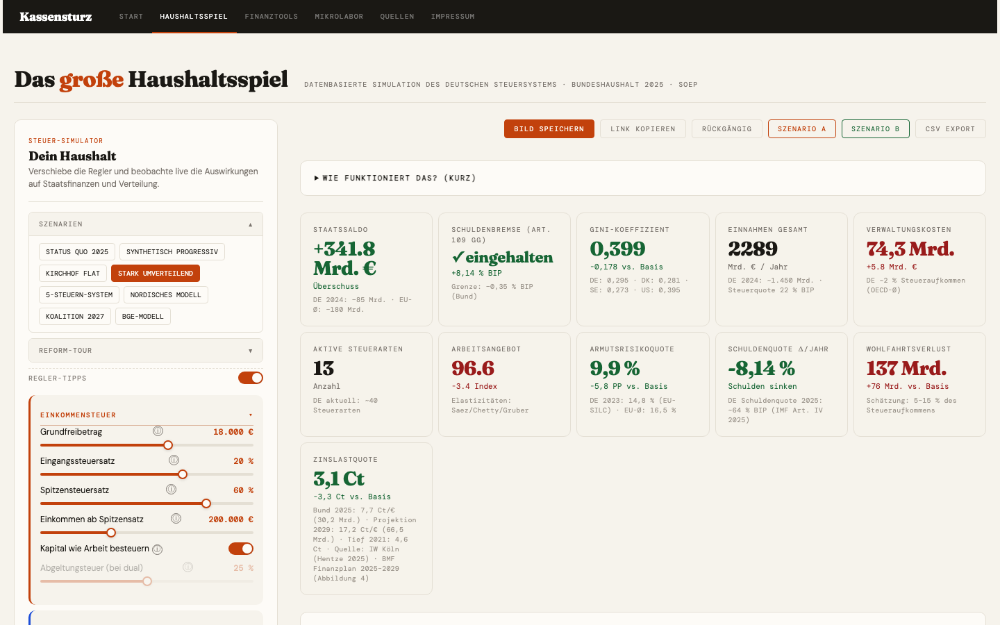

# Kassensturz

**Datenbasierte Simulation des deutschen Steuersystems und Staatshaushalts**

Kassensturz ist ein interaktives Bildungsprojekt, mit dem du Steuern und Sozialregeln anpassen und die Auswirkungen auf Staatshaushalt, Ungleichheit und einzelne Haushalte in Echtzeit beobachten kannst. Alle Kennzahlen basieren auf echten Daten (Bundeshaushalt 2025, SOEP, Destatis).

> **Live-Demo:** [floderso.github.io/Kassensturz](https://floderso.github.io/Kassensturz)

---

> **English summary:** Kassensturz is an interactive browser-based simulation of the German tax and fiscal system. Adjust sliders for income tax, VAT, CO₂ tax, social contributions and more — and observe real-time effects on the federal budget, income inequality (Gini, Palma), poverty risk, and individual households across all income deciles. Data sources: Federal Budget 2025 (BMF), SOEP v40 (DIW), Destatis. No build step, no dependencies — open `index.html` to run locally.

---

<!--
  Screenshot: Bitte eine Aufnahme des Haushaltsspiels mit ausgeklappten Reglern und KPI-Panel
  als docs/screenshot.png einchecken und die folgende Zeile einkommentieren:

  
-->

---

## Module

| Seite | Inhalt |
|---|---|
| **Haushaltsspiel** | Steuer-Simulator mit Reglern für Einkommensteuer, MwSt, CO₂-Steuer, Sozialabgaben u.v.m. Echtzeit-KPIs für Staatshaushalt, Gini-Koeffizient, Armutsrisiko und Verwaltungskosten. |
| **Finanztools** | Einzelne Finanzrechner und Visualisierungen rund um persönliche Finanzen und Steuern. |
| **Mikrolabor** | Interaktive mikroökonomische Modelle: Angebot & Nachfrage, Preiselastizität, Steuerinzidenz, Mindestlohn, Monopol. |
| **Quellen** | Vollständige Quellenangaben zu allen verwendeten Daten und Elastizitäten. |

## Szenarien

Das Haushaltsspiel enthält acht vorgefertigte Szenarien zum direkten Vergleich:

- Status quo 2025
- Synthetisch Progressiv
- Kirchhof Flat Tax
- Stark Umverteilend
- 5-Steuern-System
- Nordisches Modell
- Koalition 2027
- BGE-Modell

---

## Lokal starten

Kein Build-Schritt notwendig. Einfach `index.html` im Browser öffnen:

```bash
git clone https://github.com/Floderso/kassensturz.git
cd kassensturz
open index.html   # macOS
# oder: Datei im Browser deiner Wahl öffnen
```

Das Projekt hat **keine Abhängigkeiten** und benötigt keinen Server — es funktioniert direkt als statische HTML-Datei.

---

## Datengrundlage

| Bereich | Quelle | Stand |
|---|---|---|
| Bundeshaushalt | BMF (Finanzplan des Bundes) | 2025 |
| Steueraufkommen | BMF-Steuerschätzung | 2025 |
| Einkommensverteilung | SOEP v40 / DIW, EU-SILC | 2024/25 |
| Haushaltsstruktur | Destatis Mikrozensus | 2024 |
| Sozialversicherung | Deutsche Rentenversicherung, GKV-Spitzenverband | 2025 |
| Verhaltens-Elastizitäten | ZEW, ifo, Saez/Chetty | 2012–2024 |

Das Modell folgt dem **statischen Mikrosimulationsansatz**: 12 repräsentative Haushaltstypen (10 Dezile, D10 aufgespalten in P90–95, P95–99, Top-1%) werden durch das Steuer-Transfer-System gerechnet. Verhaltensreaktionen werden über kalibrierte Elastizitäten aus der empirischen Literatur modelliert.

Das Modell ist ein **Lernwerkzeug**, kein Prognosemodell. Es kann Größenordnungen und Trade-offs sichtbar machen, aber keine makroökonomischen Rückkopplungen oder regionalen Unterschiede präzise abbilden. Siehe [`Konzept_Steuersimulation.md`](Konzept_Steuersimulation.md) für die vollständige Modellbeschreibung.

---

## Projektstruktur

```
kassensturz/
├── index.html                  # Startseite
├── haushaltsspiel.html         # Steuer-Simulator
├── finanz.html                 # Finanztools
├── mikro.html                  # Mikrolabor
├── quellen.html                # Quellenangaben
├── impressum.html              # Impressum
├── css/
│   └── haushaltsspiel.css      # Styles für den Simulator
├── js/
│   ├── data.js                 # Datenkonstanten (Dezile, Staatsausgaben, Aufkommen)
│   └── haushaltsspiel.js       # Simulationslogik
└── Konzept_Steuersimulation.md # Modellarchitektur und wissenschaftliche Grundlage
```

---

## Mitmachen

Beiträge sind willkommen — ob Datenkorrekturen, neue Szenarien oder UI-Verbesserungen. Bitte lies zuerst [`CONTRIBUTING.md`](CONTRIBUTING.md).

---

## Lizenz

[Creative Commons Attribution 4.0 International (CC BY 4.0)](LICENSE) · Florian Aram Feuerriegel

Bei Weiterverwendung bitte Quelle und Autorenname angeben: **Florian Aram Feuerriegel · kassensturz.org**
